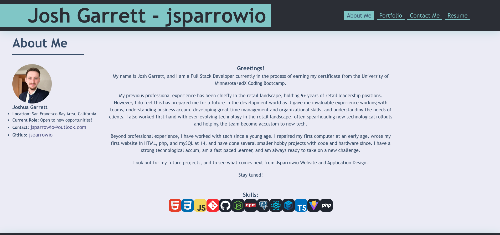

# React Portfolio

                 
## Description
  
This project was a portfolio for all of my coding work completing using ReactJS, CSS, and some HTML. The portfolio is meant to showcase all of my work completing as a Full Stack Developer, including work completed in the UofM/edX Full Stack Online Coding Bootcamp. The portfolio will also be kep up to date and evolved as more projects are completed and coding technologies learned. The site also contains some personal information, contact info, a contact me section, and a resume section.

See deployed application here

## Screenshot

  
## Table of Contents
  
- [React Portfolio](#react-portfolio)
  - [Description](#description)
  - [Screenshot](#screenshot)
  - [Table of Contents](#table-of-contents)
  - [Installation](#installation)
  - [Usage](#usage)
  - [License](#license)
  - [Contributing](#contributing)
  - [Credits](#credits)
  - [Tests](#tests)
  - [Questions](#questions)
  
## Installation
  
No need to install as it is a live single-page site. Follow link above to visit.
  
## Usage
  
To use, please visit the site and follow the various links to explore my personal information, portfolio of work, contact info, and resume.

## License

This project uses MIT License.

Please refer to LICENSE file for more information.
 
## Contributing
  
No need to contribute as project is already completed.
  
## Credits
  
No base code provided, majority of written code by Josh Garrett (jsparrowio). Some code borrowed or based on code from class activities and old challenges from the UoM/edX Coding Bootcamp. Some code based on code found on Stack Overflow.
  
## Tests
  
To test, follow deployed link above.
  
## Questions
  
If you have any additional questions, please contact me at:
  
[GitHub](https://www.github.com/jsparrowio)
  
[jsparrowio@outlook.com](mailto:jsparrowio@outlook.com)